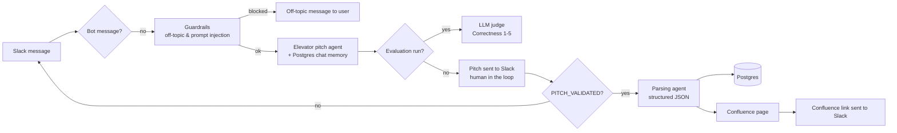

# PO Assistant

An AI pipeline built with **n8n** and **Claude** that assists Product Owners through product framing, from the first idea to ready-to-develop Jira tickets, with a human validation at every step.

This repository contains **step 1: the elevator pitch**.

> One Slack channel = one project. The PO describes an idea, the agent drafts an elevator pitch, the PO iterates and validates it in Slack, and the validated pitch is stored in Postgres and published to the project's Confluence space.

---

## How it works



1. **Onboarding.** On the first message of a channel, the agent asks for the Jira project code, the project name and the Confluence space key. It never asks again once they are known.
2. **Drafting.** As soon as an idea is shared, even a vague one, the agent writes a 4–8 sentence pitch without asking clarifying questions. Gaps are filled with explicit assumptions listed at the end.
3. **Human in the loop.** The PO requests changes in Slack. The agent edits only what was asked and keeps the rest identical. The loop runs until the PO validates.
4. **Persistence.** On validation, a parsing agent turns the pitch into structured JSON. The pitch is inserted into Postgres, a dedicated page is created in Confluence, and the link is posted back to Slack.

## Key features

| Feature | Implementation |
|---|---|
| Input security | Bot-message filter (no loops) + n8n Guardrails node blocking off-topic messages and prompt-injection attempts |
| Conversation state | Postgres chat memory, one session per Slack channel |
| Language handling | Answers 100% in the user's language (pitch, assumptions, questions) |
| Human in the loop | Slack-based review and validation loop, nothing is persisted before explicit validation |
| Structured output | Dedicated parsing agent with a structured output parser |
| Safe Confluence publishing | JSON body built with `JSON.stringify` and XHTML escaping (`&`, `<`, `>`) |
| Error handling | Retries on every node; on failure the user is notified in Slack and a global Error Workflow emails the admin a link to the failed execution |
| Evaluation | Native n8n Evaluations with an LLM-as-a-judge and a 17-case dataset |

## Evaluation

The agent is evaluated with n8n's native **Evaluations** feature:

- **Dataset:** 17 test cases covering a detailed idea, a vague idea, technical jargon, several value propositions, typos, a bullet list, a very long brief, an English message, an opinion question, a trivial message, the onboarding rule, a user-imposed format, and messages that the guardrails must block. See [`evals/elevator-pitch-eval-dataset.csv`](evals/elevator-pitch-eval-dataset.csv).
- **Judge:** the Correctness metric (1–5) with a custom prompt that embeds the agent's specification. It compares each answer to a reference answer **and** to the original user message, so it can catch factual drift. It judges meaning, not wording. See [`prompts/eval-judge.md`](prompts/eval-judge.md).
- **Eval/production switch:** a *Check if evaluating* node routes evaluation runs to the judge and production runs to the human validation step, so evaluated answers never reach Slack or the database. (Test cases blocked by the guardrails end with an error in evaluation mode, because their branch replies through Slack. This is expected.)

**Result:** ~**4.1 / 5** on average, stable across 3 consecutive runs (4.20 / 4.27 / 3.93). This was measured with Claude Haiku 4.5 as both the pitch agent and the judge. The workflow now uses Claude Opus for the pitch agent and the judge.

Remaining known weaknesses, caught by the eval: occasional drift from the original idea, one factual error on a long brief, and an unstable boundary between "vague idea" and "no idea at all". The human-in-the-loop step covers these in production.

## Repository structure

```
workflows/01-elevator-pitch.json   n8n workflow (sanitized, with sticky notes)
prompts/                           system prompts: pitch agent, parsing agent, guardrail, eval judge
evals/                             evaluation dataset
sql/schema.sql                     Postgres table
```

## Setup

**Prerequisites:** a self-hosted n8n instance (Community edition is enough), a Postgres database, a Slack app, a Confluence Cloud space and an Anthropic API key.

1. **Create the table:** run [`sql/schema.sql`](sql/schema.sql) on your Postgres database.
2. **Import the workflow:** in n8n, *Import from file* → `workflows/01-elevator-pitch.json`.
3. **Create the credentials** and assign them to the nodes that show `REPLACE_WITH_YOUR_CREDENTIAL_ID`:
   - Anthropic API
   - Postgres
   - Slack API (bot with `channels:history`, `chat:write` and the event subscriptions used by the Slack Trigger)
   - HTTP Basic Auth for Confluence (Atlassian email + API token)
4. **Set your Confluence URL** in the *Create Confluence pitch page* node: replace `YOUR-DOMAIN`.
5. **Set an Error Workflow** in the workflow settings to get admin alerts.
6. **Evaluation (optional):** create an n8n Data Table from `evals/elevator-pitch-eval-dataset.csv` and select it in the *When fetching a dataset row* and *Evaluation - Set outputs* nodes.
7. Activate the workflow and invite the bot to a Slack channel.

## Roadmap

The next steps of the PO Assistant, each as a sub-workflow driven by an orchestrator that routes on the project's status:

- [x] Elevator pitch
- [ ] Orchestrator (status-based routing between steps)
- [ ] Personas
- [ ] Roadmap
- [ ] Definition of Ready / Definition of Done
- [ ] Epics and user stories, with an automated quality-review loop
- [ ] Push to Jira

## Author

**Abderrahmen Mokrani**, Senior Product Owner.
